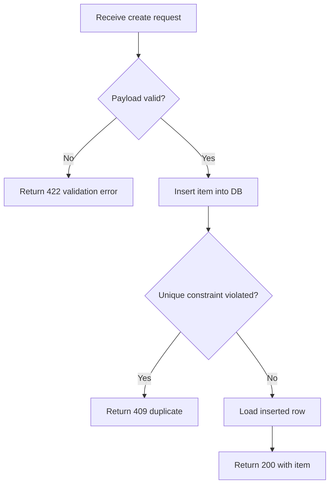
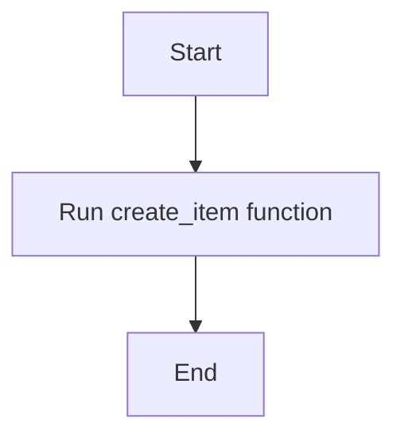

# TeaForge

TeaForge CLI converts automated tests into readable, exportable, queryable PCL documents and generates coverage reports with Mermaid flowcharts and sequence diagrams.

## When to Use

- Writing unit tests that follow Japanese-style testing methodology (parameter × branch full coverage)
- Generating PCL (test-specification) documents from existing pytest or Jest files
- Capturing observed Jest matcher evidence when static parsing cannot resolve values
- Producing coverage reports with Mermaid flowchart diagrams
- Deciding which functions deserve flowcharts in coverage reports
- Exporting test documentation to PDF

## Supported Frameworks

### pytest

- Default framework for TeaForge commands
- Best fit for current Python / FastAPI flows
- Supports the existing PCL and coverage pipeline end to end

### jest / TypeScript

- Enabled through `--framework jest`
- TeaForge-packaged Tree-sitter JavaScript, TypeScript, and TSX grammars provide structural import, test, call, exported-symbol, and source-function evidence
- Current test support focuses on a constrained but practical subset:
    `test(...)`, `it(...)`, `test.only(...)`, `it.only(...)`, nested `describe`, array-literal `test.each([...])(...)`, and `describe.each([...])(...)`
- Current coverage support expects Jest to emit Istanbul `coverage-final.json`
- Current import resolution supports relative ESM imports and common CommonJS `require` forms
- Current source parsing supports top-level function declarations, arrow functions, and class methods
- Use `--evidence-mode runtime` to record matcher, expected, actual, pass/fail, `.not`, Promise, and thrown-error evidence from the project-local Jest
- Use `--evidence-mode auto` when runtime evidence is preferred but static fallback is acceptable
- Runtime evidence supplements the static design expectation instead of overwriting it
- Runtime execution uses only the discovered project-local or workspace-hoisted Jest; TeaForge never invokes `npx` or downloads a runner
- Runtime values apply default sensitive-key/common credential redaction, value truncation, and bounded evidence limits; producer warnings are preserved in the PCL

### angular / Playwright

- Use `--framework angular` for Angular/Jest page semantics and Angular coverage
- Use `--framework playwright` for page actions and UI/navigation PCL extraction
- Playwright coverage is not currently supported

## Japanese-Style Unit Testing Methodology

### Parameter Coverage

Cover normal, boundary, and abnormal parameters:

| Category | Description |
|----------|-------------|
| Normal | One representative valid value |
| Boundary | Values at and just beyond each boundary |
| Abnormal | Illegal values, wrong types, exceptional inputs |

### Branch Coverage (Target: 100% C1)

Cover every execution path through the function:

| Path Type | Description |
|-----------|-------------|
| Normal path | Function executes as expected, returns correct result |
| Conditional branches | Every `if/else`, `match/case`, early return |
| Exception paths | Every branch that raises or handles an exception |

### Test Case Principles

1. **Single responsibility** — each test case verifies exactly one behavior.
2. **Minimal delta** — each test case differs from the previous by exactly one input or one branch choice.
3. **Derive from baseline** — write one test for the normal value + normal path, then create boundary/abnormal variants by making small modifications to that baseline.

## CLI Reference

| Command | Purpose |
|---------|---------|
| `teaforge doctor --framework <framework> --path <tests> --python-executable <venv-python> --json` | Check packaged resources, target interpreter/test-runner discovery, and optional renderer capabilities without running tests |
| `teaforge pcl generate --path <tests> --output <html>` | Generate PCL document from test file or directory |
| `teaforge pcl generate --framework jest --evidence-mode runtime --path <jest-test> --output <html>` | Generate PCL with observed Jest assertion evidence |
| `teaforge export --path <html> --output <pdf>` | Export HTML report to PDF |
| `teaforge get --path <json\|html> --testcase <code\|name>` | Query a specific test case |
| `teaforge mermaid validate --code <mermaid>` | Validate Mermaid syntax |
| `teaforge mermaid generate --source <file> --function <fn> --diagram-type <flowchart\|sequence> --code <mermaid> --output-dir <dir>` | Validate and persist a typed Mermaid source file |
| `teaforge coverage generate --path <tests> --output <html> --function <fn> --sequence <fn> --diagram-dir <dir> --min-c0 <pct> --min-c1 <pct>` | Generate coverage report with flowchart/sequence pages and optional file-level gates |
| `teaforge coverage generate --framework jest --path <jest-test> --output <html> --function <fn> --diagram-dir <dir>` | Generate a Jest / TypeScript coverage report |

## Procedure

### Writing Tests

1. Identify the target function and read its source code.
2. List all parameters with their normal, boundary, and abnormal values.
3. Map every branch (`if/else`, `try/except`, early return) in the function.
4. Write a baseline test for the normal path with normal parameters.
5. Derive variant tests — change exactly one input or trigger exactly one different branch per test.
6. Inspect the C1 result from `teaforge coverage generate` and add tests until all intended branches are covered. In CI, pass `--min-c0` and `--min-c1`; an unmet gate preserves the reports and exits with code `3`.

### Choosing the Framework

1. Use the default `pytest` flow for Python tests.
2. Use `--framework jest` for Node.js / TypeScript Jest tests.
3. Keep the framework choice consistent between PCL generation and coverage generation.
4. Before automation, run `teaforge doctor --framework <framework> --path <tests> --json` and stop if `ready` is false.

### Generating Coverage Reports (End-to-End)

Coverage reports accept Mermaid flowcharts and sequence diagrams for selected business functions. The AI is responsible for choosing the useful diagram type, writing the Mermaid code, and invoking the CLI.

1. **Read the source file** under test to understand all function signatures and bodies.
2. **Select business functions** that need flowcharts, sequence diagrams, or both.
3. **Write Mermaid code** for each selected function.
4. **Validate** each diagram: `teaforge mermaid validate --code "<mermaid>"`.
5. **Persist** each diagram: `teaforge mermaid generate --source <source-file> --function <fn> --code "<mermaid>" --output-dir <diagram-dir>`.
6. **Generate the report**:
    - pytest: `teaforge coverage generate --path <pytest> --output <report.html> --function <fn1> --function <fn2> --diagram-dir <diagram-dir>`
    - jest: `teaforge coverage generate --framework jest --path <jest-test> --output <report.html> --function <fn1> --function <fn2> --diagram-dir <diagram-dir>`

The `--function` flag adds flowchart pages and `--sequence` adds sequence-diagram pages. Both are repeatable and may target the same function.

### Jest-Specific Notes

- `test.each([...])(...)` is supported and should be preferred for boundary-value matrices in Jest.
- The AI should still follow the same Japanese PCL principle: derive neighboring boundary / abnormal cases from one normal baseline.
- TeaForge currently expects Jest row data to be statically readable array literals.
- If the parser cannot prove the business source file under test, PCL generation may still fallback for display, but coverage generation will fail fast.
- Prefer runtime evidence for older or dynamically written tests whose variables cannot be resolved statically. It requires an already-installed project-local Jest and intentionally never downloads one.
- A completed Jest run with failing tests still writes the evidence report and returns exit code `2`. Do not treat it as a TeaForge generation error; either fix the test or deliberately pass `--allow-test-failures`.
- Use `--runtime-timeout` to bound Jest execution. For pytest coverage in another virtual environment, pass `--python-executable <project-venv-python>`.

### Sequence Diagram Selection

Use a sequence diagram when the important fact is interaction order across callers, business logic, persistence, or external systems. Keep flowcharts for internal branches and exits. TeaForge expects the AI to provide `sequenceDiagram` Mermaid; assertion values alone are not sufficient to infer a trustworthy call trace.

Generate it with `--diagram-type sequence`, then include it in coverage with `--sequence <fn>`.

### Flowchart Selection

The AI must read the source code and decide which functions deserve a flowchart page in the coverage report.

**Generate flowcharts for:**
- Controllers, route handlers, service-layer functions
- Any function containing `if/else`, `match/case`, `try/except`, or early `return` — i.e. non-trivial branching logic
- Functions that are the **core business logic** of the module

**Skip flowcharts for:**
- Simple getters, property accessors, one-liner helpers (e.g. `_db_path`)
- Thin wrapper functions that only delegate to another function
- `__init__`, `__repr__`, `__str__` and similar boilerplate methods
- Functions with zero branching (straight-line code)

**Rule of thumb:** If the function body has no `if`, `else`, `elif`, `try`, `except`, `for`, `while`, or `match`, it almost certainly does not need a flowchart.

### Writing Mermaid Flowcharts

The AI reads the function source code and produces a Mermaid `flowchart TD` (top-down) diagram. The flowchart must accurately represent the function's **internal control flow** — this is the most important requirement.

#### What to Include

The flowchart must capture every **branch point** and **exit path** inside the function:

| Element | How to Represent |
|---------|-----------------|
| Entry point | `A[Descriptive start action]` — e.g. `A[Receive create request]` |
| Conditional branch | `B{Condition?}` with `-- Yes -->` and `-- No -->` edges |
| Validation / guard clause | Decision diamond followed by error return |
| Exception handling | `try` path and `except` path as separate branches |
| Early return | Branch edge leading directly to end/error node |
| Loop | Cycle back to a previous node |
| Normal exit | `Z[Return result]` or similar |

#### What NOT to Include

- Do **not** draw the function's callers or calling context — only internal logic.
- Do **not** collapse the entire function into a single "Execute" box.
- Do **not** include trivial implementation details (variable assignments, logging) that don't affect control flow.

#### Syntax Rules

- Must start with `flowchart TD` (top-down direction).
- Use `[text]` for action nodes, `{text?}` for decision diamonds.
- Use `-- Label -->` for labeled edges.
- Keep node labels short and descriptive — describe *what* happens in business terms, not code-level detail.
- Ensure every branch has a terminal node (no dangling edges).

#### Example: Good Flowchart



This diagram shows:
- Input validation branch (valid / invalid)
- Database constraint branch (duplicate / success)
- Three distinct exit paths (422, 409, 200)

#### Example: Bad Flowchart (Do NOT Produce)



This diagram is useless — it shows no branching, no error paths, no business logic.

#### File Naming Convention

When using `teaforge mermaid generate`, the CLI automatically names the `.mmd` file as:
```
{source_stem}_{function_name}_coverage_report.mmd
```
For example, source `main.py` + function `create_item` → `main_create_item_coverage_report.mmd`.
For TypeScript, source `user.ts` + function `createUser` → `user_createuser_coverage_report.mmd`.

### Generating PCL Documents

1. Run one of these:
    - pytest: `teaforge pcl generate --path <pytest file> --output <output.html>`
    - jest: `teaforge pcl generate --framework jest --path <jest-test> --output <output.html>`
2. Optionally export to PDF: `teaforge export --path <output.html> --output <output.pdf>`.
