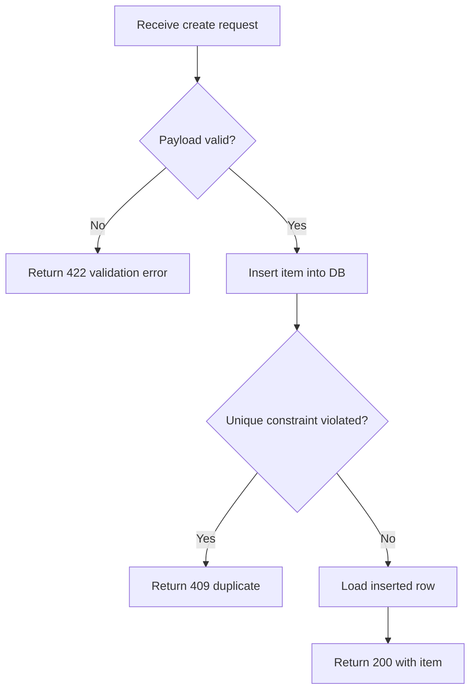
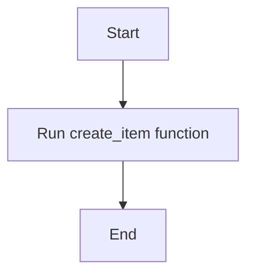

# TeaForge

TeaForge CLI converts pytest automated tests into readable, exportable, queryable PCL documents and generates coverage reports with Mermaid flowcharts.

## When to Use

- Writing unit tests that follow Japanese-style testing methodology (parameter × branch full coverage)
- Generating PCL (test-specification) documents from existing pytest files
- Producing coverage reports with Mermaid flowchart diagrams
- Deciding which functions deserve flowcharts in coverage reports
- Exporting test documentation to PDF

## Japanese-Style Unit Testing Methodology

### Parameter Coverage

Cover normal, boundary, and abnormal parameters:

| Category | Description |
|----------|-------------|
| Normal | One representative valid value |
| Boundary | Values at and just beyond each boundary |
| Abnormal | Illegal values, wrong types, exceptional inputs |

### Branch Coverage (Target: 100% C1)

Cover every execution path through the function:

| Path Type | Description |
|-----------|-------------|
| Normal path | Function executes as expected, returns correct result |
| Conditional branches | Every `if/else`, `match/case`, early return |
| Exception paths | Every branch that raises or handles an exception |

### Test Case Principles

1. **Single responsibility** — each test case verifies exactly one behavior.
2. **Minimal delta** — each test case differs from the previous by exactly one input or one branch choice.
3. **Derive from baseline** — write one test for the normal value + normal path, then create boundary/abnormal variants by making small modifications to that baseline.

## CLI Reference

| Command | Purpose |
|---------|---------|
| `teaforge pcl generate --path <pytest> --output <html>` | Generate PCL document from pytest file |
| `teaforge export --path <html> --output <pdf>` | Export HTML report to PDF |
| `teaforge get --path <json\|html> --testcase <code\|name>` | Query a specific test case |
| `teaforge mermaid validate --code <mermaid>` | Validate Mermaid syntax |
| `teaforge mermaid generate --source <file> --function <fn> --code <mermaid> --output-dir <dir>` | Persist and render a Mermaid diagram |
| `teaforge coverage generate --path <pytest> --output <html> --function <fn> --diagram-dir <dir>` | Generate coverage report with flowcharts |

## Procedure

### Writing Tests

1. Identify the target function and read its source code.
2. List all parameters with their normal, boundary, and abnormal values.
3. Map every branch (`if/else`, `try/except`, early return) in the function.
4. Write a baseline test for the normal path with normal parameters.
5. Derive variant tests — change exactly one input or trigger exactly one different branch per test.
6. Verify C1 coverage reaches 100% using `teaforge coverage generate`.

### Generating Coverage Reports (End-to-End)

Coverage reports require Mermaid flowcharts for selected business functions. The AI is responsible for **choosing which functions need flowcharts**, **writing the Mermaid code**, and **invoking the CLI**. Follow these steps:

1. **Read the source file** under test to understand all function signatures and bodies.
2. **Select business functions** that need flowcharts (see Flowchart Selection below).
3. **Write Mermaid flowchart code** for each selected function (see Writing Mermaid Flowcharts below).
4. **Validate** each diagram: `teaforge mermaid validate --code "<mermaid>"`.
5. **Persist** each diagram: `teaforge mermaid generate --source <source.py> --function <fn> --code "<mermaid>" --output-dir <diagram-dir>`.
6. **Generate the report**: `teaforge coverage generate --path <pytest> --output <report.html> --function <fn1> --function <fn2> --diagram-dir <diagram-dir>`.

The `--function` flag is repeatable — pass it once per function that has a flowchart.

### Flowchart Selection

The AI must read the source code and decide which functions deserve a flowchart page in the coverage report.

**Generate flowcharts for:**
- Controllers, route handlers, service-layer functions
- Any function containing `if/else`, `match/case`, `try/except`, or early `return` — i.e. non-trivial branching logic
- Functions that are the **core business logic** of the module

**Skip flowcharts for:**
- Simple getters, property accessors, one-liner helpers (e.g. `_db_path`)
- Thin wrapper functions that only delegate to another function
- `__init__`, `__repr__`, `__str__` and similar boilerplate methods
- Functions with zero branching (straight-line code)

**Rule of thumb:** If the function body has no `if`, `else`, `elif`, `try`, `except`, `for`, `while`, or `match`, it almost certainly does not need a flowchart.

### Writing Mermaid Flowcharts

The AI reads the function source code and produces a Mermaid `flowchart TD` (top-down) diagram. The flowchart must accurately represent the function's **internal control flow** — this is the most important requirement.

#### What to Include

The flowchart must capture every **branch point** and **exit path** inside the function:

| Element | How to Represent |
|---------|-----------------|
| Entry point | `A[Descriptive start action]` — e.g. `A[Receive create request]` |
| Conditional branch | `B{Condition?}` with `-- Yes -->` and `-- No -->` edges |
| Validation / guard clause | Decision diamond followed by error return |
| Exception handling | `try` path and `except` path as separate branches |
| Early return | Branch edge leading directly to end/error node |
| Loop | Cycle back to a previous node |
| Normal exit | `Z[Return result]` or similar |

#### What NOT to Include

- Do **not** draw the function's callers or calling context — only internal logic.
- Do **not** collapse the entire function into a single "Execute" box.
- Do **not** include trivial implementation details (variable assignments, logging) that don't affect control flow.

#### Syntax Rules

- Must start with `flowchart TD` (top-down direction).
- Use `[text]` for action nodes, `{text?}` for decision diamonds.
- Use `-- Label -->` for labeled edges.
- Keep node labels short and descriptive — describe *what* happens in business terms, not code-level detail.
- Ensure every branch has a terminal node (no dangling edges).

#### Example: Good Flowchart



This diagram shows:
- Input validation branch (valid / invalid)
- Database constraint branch (duplicate / success)
- Three distinct exit paths (422, 409, 200)

#### Example: Bad Flowchart (Do NOT Produce)



This diagram is useless — it shows no branching, no error paths, no business logic.

#### File Naming Convention

When using `teaforge mermaid generate`, the CLI automatically names the `.mmd` file as:
```
{source_stem}_{function_name}_coverage_report.mmd
```
For example, source `main.py` + function `create_item` → `main_create_item_coverage_report.mmd`.

### Generating PCL Documents

1. Run `teaforge pcl generate --path <pytest file> --output <output.html>`.
2. Optionally export to PDF: `teaforge export --path <output.html> --output <output.pdf>`.
